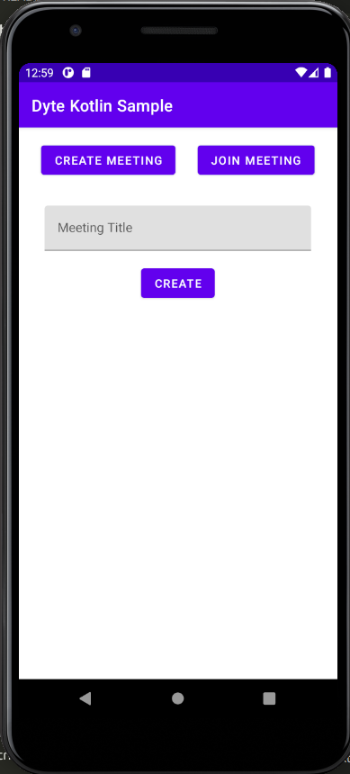
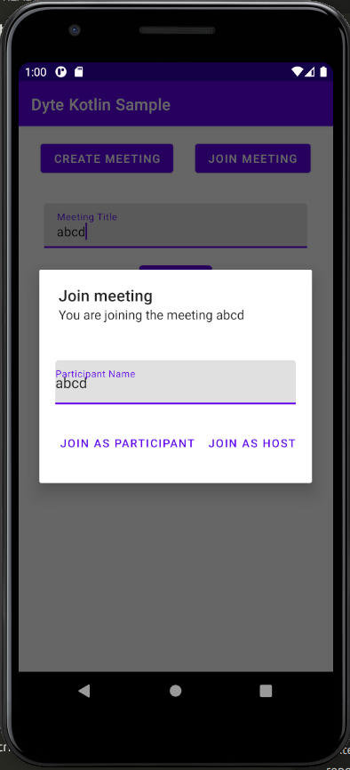
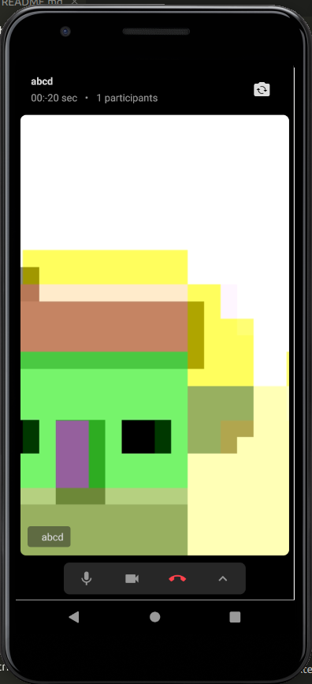
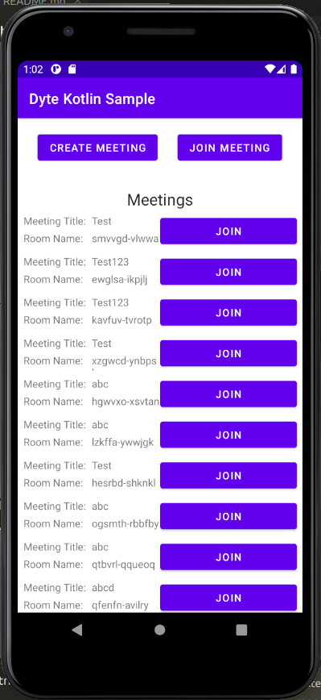

<!-- PROJECT LOGO -->
<p align="center">
  <a href="https://dyte.io">
    
  </a>

  <h2 align="center">Dyte Kotlin Sample App</h3>

  <p align="center">
    An example app in kotlin using the Dyte Mobile SDK
    <br />
    <a href="https://docs.dyte.io"><strong>Explore the docs »</strong></a>
    <br />
    <br />
    <a href="https://app.dyte.io">View Demo</a>
    ·
    <a href="https://github.com/dyte-in/docs-template/issues">Report Bug</a>
    ·
    <a href="https://github.com/dyte-in/docs-template/issues">Request Feature</a>
  </p>
</p>

<!-- TABLE OF CONTENTS -->

## Table of Contents

- [Table of Contents](#table-of-contents)
- [About The Project](#about-the-project)
  - [Built With](#built-with)
- [Getting Started](#getting-started)
  - [Prerequisites](#prerequisites)
  - [Installation](#installation)
- [Usage](#usage)
- [Version History](#version-history)
- [Roadmap](#roadmap)
- [Contributing](#contributing)
- [Support](#support)
- [License](#license)
- [About](#about)

<!-- ABOUT THE PROJECT -->

## About The Project

This repository hosts an example application to use the Dyte Mobile SDK for Kotlin, and showcases the various functionality that is possible with the SDK. For more information, [view the documentation for our Android SDK here](https://docs.dyte.io/android/installation)

This app interacts with the Dyte Rest API using the [sample app backend, which can be found here](https://github.com/dyte-in/backend-sample-app).
### Built With

- [Kotlin](https://kotlinlang.org/)
- [Dyte Mobile SDK](https://docs.dyte.io/android/installation)
- [Retrofit](https://square.github.io/retrofit/)
- [Android Studio](https://developer.android.com/studio)

<!-- GETTING STARTED -->

## Getting Started

To get a local copy up and running follow these simple steps.

### Prerequisites

- Android Studio (With Kotlin Plugin)

### Installation

1. Clone the repo

```sh
git clone git@github.com:dyte-in/kotlin-sample-app.git
```

2. Open the project in Android Studio.
3. Click the build/run button to run the app in an emulator/physical device

## Usage

The app has two main functionalities:

- Creating a meeting:

To create a meeting, switch to the create meeting tab using the "Create meeting" button:



Enter the meeting title, and then hit the create button



And then click the Join the participant/host button to join the meeting:




To join an existing meeting, click the Join meeting button:




<!-- CHANGELOG -->

## Version History

See [CHANGELOG](./CHANGELOG.md).

<!-- ROADMAP -->

## Roadmap

See the [open issues](https://github.com/dyte-in/docs-template/issues) for a list of proposed features (and known issues).

<!-- CONTRIBUTING -->

## Contributing

Contributions are what make the open source community such an amazing place to be learn, inspire, and create. Any contributions you make are **greatly appreciated**. Sincere thanks to all [our contributors](Thank you, [contributors](https://github.com/dyte-in/docs-template/graphs/contributors)!)!

You are requested to follow the contribution guidelines specified in [CONTRIBUTING.md](./CONTRIBUTING.md) and code of conduct at [CODE_OF_CONDUCT.md](./CODE_OF_CONDUCT.md) while contributing to the project :smile:.

## Support

(Ask for support or sponsorships by providing links or just add a simple message)

Contributions, issues, and feature requests are welcome!
Give a ⭐️ if you like this project!

<!-- LICENSE -->

## License

Distributed under the Apache License, Version 2.0. See [`LICENSE`](./LICENSE) for more information.

<!-- MARKDOWN LINKS & IMAGES -->
<!-- https://www.markdownguide.org/basic-syntax/#reference-style-links -->

## About

`kotlin-sample-app` is created & maintained by Dyte, Inc. You can find us on Twitter - [@dyte_io](twitter.com/dyte_io) or write to us at `dev [at] dyte.io`.

The names and logos for Dyte are trademarks of Dyte, Inc.

We love open source software! See [our other projects](https://github.com/dyte-in) and [our products](https://dyte.io).
